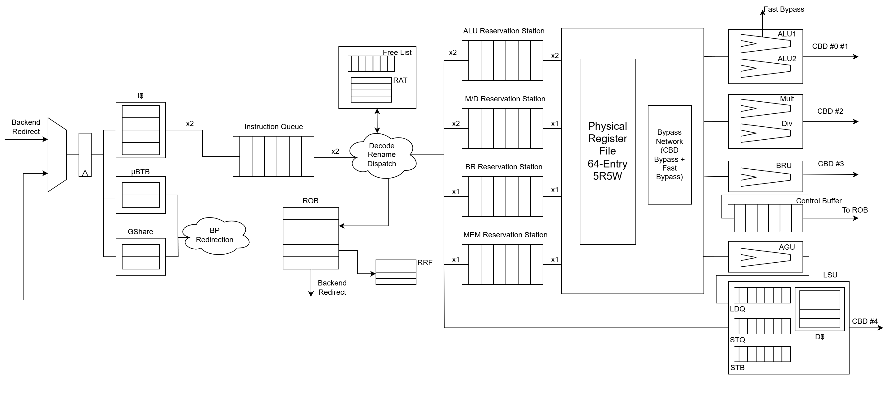

# IWD
IWD is a 2-way superscalar, OoO processor that focuses on a short pipeline and low instruction latency. Course final project of ECE411@UIUC (Fall 2024).

Joint effort of [Chiming Ni](https://github.com/nice-mee), [Kongning Lai](https://github.com/kongninglai), [Siying Yu](https://github.com/sy2u), and [Hengjia Yu](https://github.com/siriuxyu).

## Design


## Performance

### Overall
|Rank|Team|f<sub>max</sub> (MHz)|Area (µm<sup>2</sup>)| 
|--:|---|--:|--:|
|1|Orion|```526.32```|```232840```| 

### Detailed Metrics
| Benchmark   | Rank |      IPC | Delay (μs) | Power (mW) | PD<sup>3</sup>A<sup>½</sup> |
| :---------- | ---: | -------: | ---------: | ---------: | --------------------------: |
| coremark    |    1 | `0.7542` |   `734.55` |   `23.643` |                      `4.52` |
| aes_sha     |    2 | `0.5602` |  `2214.51` |   `22.820` |                    `119.59` |
| cnn         |    2 | `0.5817` |  `4510.96` |   `23.341` |                   `1033.83` |
| compression |    1 | `1.1482` |   `695.00` |   `23.935` |                      `3.88` |
| fft         |    1 | `0.9250` |  `1056.80` |   `23.157` |                     `13.19` |
| mergesort   |    1 | `0.8387` |  `1057.52` |   `23.897` |                     `13.64` |
| raytracing  |    2 | `0.8949` |  `1533.87` |   `23.117` |                     `40.25` |
| rsa         |    2 | `0.3157` | `14802.16` |   `23.020` |                  `36025.88` |
