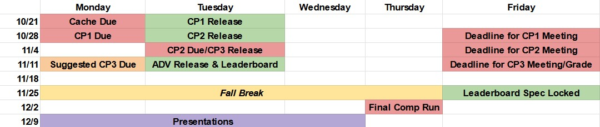
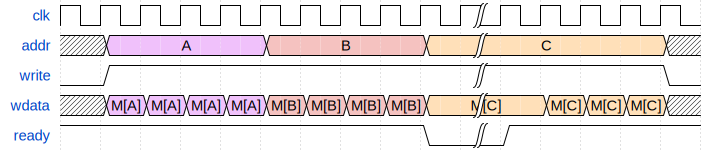
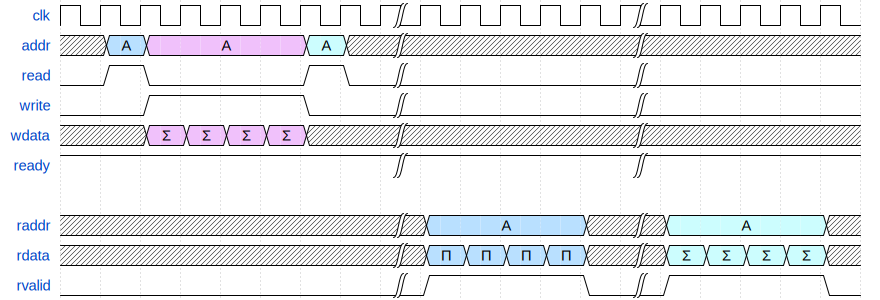

# ECE 411: mp_ooo

This document, README.md, forms the specification for the machine problem. For
more details and documentation, visit the `docs` folder. Inside, you will find:

- [GUIDE.md](./docs/GUIDE.md): Some tips and resources for this MP.
- [ADVANCED_FEATURES.md](./docs/ADVANCED_FEATURES.md): List of advanced features
  and their associated point values.
- [WHAT_IS_AN_OOO.md](./docs/WHAT_IS_AN_OOO.md): Basic overview of an OoO
  processor.
- [TEST_CASES.md](./docs/TEST_CASES.md): Basic overview of the test cases.
- [COMPETITION.md](./docs/COMPETITION.md): Basic overview of the competition.

# Introduction

This machine problem involves the design of an out-of-order microprocessor. You
are required to implement the RV32IM instruction set (with the exception of
FENCE*, ECALL, EBREAK, and CSRR instructions). This handout is an incomplete
specification to get you started with your design, as a large portion of this
machine problem is left open ended for you to explore design options that
interest you.

## Point Breakdown

| Checkpoint          | Points |
|---------------------|--------|
| CP 1                | 15     |
| CP 2                | 15     |
| CP 3                | 20     |
| Competition         | 20     |
| Advanced Features   | 20     |
| Presentation/Report | 10     |

**Total Points:** 100

Detailed rubrics for each checkpoint will be added below closer to their release
date.

Students can also score up to 10 points of extra credit by making additional
advanced features - more about this will be detailed in the Advanced Features
section. You can also receive +2 extra credit points on CP2 for Verilator tooling. The maximum possible grade on this MP will be *112 points*.

## Overview

By the end of this MP, you can expect to have made an out-of-order processor
implementing:

- Either Tomasulo's Algorithm or an Explicit Register Renaming scheme
- Split instruction cache and data cache
- Support for multiplication and division instructions
- Advanced features of your choice!

In total, this MP will span 6 weeks. The first 3 weeks of this MP will be
centered around developing the core microarchitecture for an RV32IM OoO
processor. By week 2, you will have picked either a Tomasulo-style or ERR-style
processor. Based on your choice, your group will be assigned a mentor CA/TA that
has worked with that microarchitecture in the past. They will be your primary
source of guidance throughout this MP, and will also be responsible for grading
your submissions. You will have weekly meetings to discuss your progress on the
MP and grade your checkpoints.

The final 3 weeks will be a design competition. Course staff will maintain a
"Leaderboard", which periodically runs various benchmarks using your
processor. You will be ranked against your classmates' processors, as well as a
simple baseline processor written by course staff. You can learn more in the
[competition section](#Competition).

## mp_cache Dependency

Checkpoint 3 of this MP involves integrating data and instruction caches with
your processor - typically, this is done by using modified versions of
`mp_cache`.

If your group was unable to complete `mp_cache`, don't worry - we will provide
the RTL for a direct-mapped write-through cache before the CP3 release. However,
this cache will be less performant and area/energy-efficient than the
set-associative pipelined cache architecture from before. We highly recommend
attempting to complete/fix your `mp_cache` submission to maximize performance
during the design competition.

## Outside Code

For this MP, all the RTL/code that you use should be your own, with the
exception of course-staff provided resources. In addition, you may use any IP
categorized under `Datapath: Arithmetic Components`, `Datapath: Floating Point`,
and `Datapath: Sequential Components` as categorized by [the designware
docs](https://www.synopsys.com/dw/buildingblock.php). The most relevant IP for
implementing RISC-V extensions will be:

- Multiplier
- Divider
- Relevant functional units in `Datapath: Floating Point`

Use of other outside RTL/code is prohibited.

# Checkpoints

This MP is split into 3 mandatory checkpoints, and a final evaluation after the
design competition.

## Submissions

Below is a schedule for `mp_ooo`.

As you can see, `mp_ooo` is a fast-paced MP with heavy dependencies between
checkpoints. It is in your best interest to start early and stay synced with
your mentor.

You will be graded by your mentor during your weekly meetings, based on a commit
of your choice This commit should be pushed to github before the stated deadline
on each checkpoint.

## Late Policy

Each checkpoint will be graded with the standard late policy shown [on the class
website](https://courses.grainger.illinois.edu/ece411/fa2024/policy.html).

There will be no partial credit awarded beyond what is outlined in the rubrics below.

## Checkpoint 1 (15 points)

**_Due 10/28, 11:59PM_**

In this checkpoint, you will be designing the high-level microarchitecture for
your processor, creating the front-end fetch stage, and integrating it with a
DRAM model. At this time, you should also decide whether you will be developing
a Tomasulo-style or ERR-style microarchitecture.

While it is not required until CP3, if you have a working `mp_cache` we
recommend integrating it with your fetch stage during this CP. It will save you
time when debugging CP3.

**Requirements:**
- Draw a design block diagram (using draw.io or similar, **not handwritten!**)
  of your OoO datapath [6]
  - Graded on completeness, state/information flow, and readability
- Implement and test a parameterizable queue (depth and width) [3]
  - You are expected to identify relevant edge-cases of a FIFO, and show your
    tests for them
- Implement and test a cacheline adapter to deserialize a burst out of the DRAM
  model [3]
- Implement instruction fetch and integrate it with your cacheline adapter and
  queue [3]
    - Your program counter should be initialized to `0x1ECEB000`

## Checkpoint 2 (15 points)

~**_Due 11/4, 11:59PM_**~

**_Due 11/5, 11:59PM_**

By the end of this checkpoint, your processor will be able to execute all
immediate and register instructions in the RV32I spec. In addition, you will be
responsible for integrating multiplier and divider Synopsys IPs to implement the
RISC-V M extension.

In addition, from this checkpoint onwards we will be introducing a toolflow
based on Verilator. Verilator is a cycle-level simulator that runs
(significantly) faster than VCS. You can learn more about this toolflow in
[VERILATOR.md](./docs/VERILATOR.md). Verilator is **optional** and now worth extra credit in CP2.

You will need to handle the DIV-0 edgecase - please look at the RV32 ISA spec to
understand the expected behavior here.

**Requirements**
- Implement your OoO architecture such that it can execute all immediate and
  register instructions in RV32I [5]
- Integrate the multiplier IP with your processor to perform all MUL
  instructions in RV32M [2]
- Integrate the divider IP with your processor to perform all DIV/REM
  instructions in RV32M [2]
- Modify your `mp_verif` random testbench to test coverage on all the
  instructions required for this CP [2]
- Demonstrate that your processor is able to execute instructions out-of-order
  (via `testcode/ooo_test.s`) [2]
- Show that your processor is compliant with Spyglass linter [2]
- Show that your processor is compliant with Verilator linter [+2 Extra Credit]

*There will be no provided tests outside of ooo_test.s* - if you are unable to
correctly modify the random testbench, the onus of creating comprehensive tests
to demonstrate what you have completed falls on you.

## Checkpoint 3 (20 points)

**_Recommended Due Date: 11/11, 11:59PM_**

**_Hard Cutoff: 11/15, 11:59PM_**

By the end of this checkpoint, your processor will be able to execute the
entirety of the RV32IM spec (barring the exceptions outlined
[here](#Introduction)). You will also integrate data caches and instruction
caches with your processor, and add necessary arbiting logic for the DRAM model.

Your primary deliverables for this checkpoint will be the following:

- Integrate instruction caches and data caches with your core
  - Add any necessary write/arbiter logic to the cacheline adapter
- Support all memory instructions
  - Memory instructions can be performed in order on ROB commit
  - Recommended to support loads before ROB commit (refer to lab)
- Support all control instructions (BR, JAL, JALR) and AUIPC if not yet
  implemented
  - Not required to support branch prediction yet, static not-taken is okay

This will be the first checkpoint graded by an autograder, namely the
leaderboard. In the meantime, you can use random/targeted tests,
`coremark_im`, and any other released tests in order to test your processor. 
Additionally, there will be no partial credit for this checkpoint - you will 
need to fulfill all the leaderboard criteria listed below to get credit.

Ideally, you are able to complete this checkpoint by 11/11. Your graded
deliverable will be completing a successful run on the leaderboard by
11/15. This is construed as a leaderboard run with a nonzero score. As the
leaderboard will only begin running on 11/12, we highly recommend you construct
your own tests prior to this date.

# Final Submission: Competition + Advanced Features + Report (50)
## Competition (20)

This portion of your grade will be determined by how you fare in comparison to a
baseline processor and your peers' processors while performing various
staff-selected benchmarks. You will be evaluated on correctness and relative
performance. An incorrect run of a benchmark (per spike log) will not score any
points.

The initial benchmark suite and the related performance metrics will be
announced on the first day of the leaderboard (*11/15*). We will add more
programs to this suite over the following 3 weeks, and freeze the benchmark list
on *11/29*.

See [COMPETITION.md](./docs/COMPETITION.md) for more information on grading and the
leaderboard calculations.

### Leaderboard
The leaderboard, like AG for past MPs, will run periodically and test a series
of benchmarks on your processor. If a benchmark is found to run correctly,
then the Leaderboard will assign a nonzero score based on staff-picked metrics. 
Coremark is confirmed to be in this test suite, and you will receive copies of any additional "open" benchmarks when
the leaderboard is first deployed.

To show up on the leaderboard, your processor must:
- Be connected to RVFI
- Match Spike and RVFI on **each test case (no points for a testcase you don't match)**
- Be synthesizable and meet timing at the frequency you specify in options.json

Note that not all leaderboard benchmarks will be public - staff will curate a
series of "closed" benchmarks that will not be distributed as part of the
`mp_ooo` release. However, you will be informed of their computational
characteristics. Check out [TEST_CASES.md](./docs/TEST_CASES.md).

## Advanced Features (20)

This is the fun part of `mp_ooo` - optimizing your processor! You will be
implementing processor enhancements of your choice. A list of example advanced
features and their associated point values can be found in
[ADVANCED_FEATURES.md](./docs/ADVANCED_FEATURES.md). Some of these features
require significant design considerations when constructing the core
microarchitecture, so be sure to take a look at this early on in your design
process.

The baseline requirement for this section is two-fold. You will need to
implement advanced features that span *at least 3 different categories* based on
[ADVANCED_FEATURES.md](./docs/ADVANCED_FEATURES.md). In addition, the point
total of your advanced features must be *at least 20*. You will be graded only
on the advanced features implemented *on your competition submission*. Note that
you cannot get points for two features in the same category until the
three-category minimum is met.

Once the above requirements have been met, you can accrue extra credit based on
your advanced features. Any advanced feature points on your competition
processor over the minimum of 20 will score normally. Advanced features stored
on a separate branch will be graded at half the original score (ex: a 2-way
superscalar branch that was not used for the competition would score only 6
points). Extra credit will be capped at 10 points.

Note that you will need to justify your advanced feature selection during your
final report, and include quantitative analysis of the performance
benefit/degradation caused by each advanced feature. *This is required to score
any points for a feature*.

### Example Advanced Feature Configurations

These would be configurations meeting the minimum requirements for advanced
features.

- GShare + BTB, Split LSQ, Post-Commit Buffer w/ Coalescing, Next-Line
  Prefetcher (Total: 20 points)
- 2-way Superscalar, Post-Commit Store Buffer, Advanced Benchmark Analysis
  (Total: 20 points)

## Final Presentation (10)

At the conclusion of the project, you will give a presentation to the course
staff (and fellow students) about your design. In addition, you need to collect
your performance analyses and paper designs together as a final report that
documents your accomplishments. More information about both the presentation and
report will be released closer to the deadline.

## Group Evaluations

At the end of the project, each group member will submit feedback on how well
the group worked together and how each member contributed to the project. The
evaluation, along with feedback provided at TA meetings throughout the semester,
will be used to judge individual contribution to the project.

Although the group evaluation occurs at the end of the project, this should not
be the first time your mentor TA hears about problems that might be
occurring. If there are major problems with collaboration, the problems should
be reflected in your TA meetings, or in private communication with your TA. The
responses on the group evaluation should not come as a surprise to anyone.

In the event of significant to extreme imbalance in work distribution between
team members, course staff reserves the right to apply corrective bonuses and
penalties to the affected students. This will be done only on a case-by-case
basis.

# Memory Model

Also called the DRAM model, you will use a banked burst memory model throughout
this MP.  Unlike previous memory models used throughout the semester, this model
supports **multiple outstanding requests**. This means you can send multiple
requests before the first response comes back from memory. Furthermore, if you
issue multiple read requests, they might come back in a different order than you
sent the requests. Writes will **not** be handled out of order.

You are free to use this feature or not at your discretion. It may help
performance significantly when paired with other advanced features. If you
prefer, you can ignore this feature and use it very similarly to previous memory
models which only supported one outstanding request.

  
Single Read Request
 

  
Single Write Request
 

  
Read Queue Full
 

  
Write Queue Full
 

  
Out-Of-Order Read Response
 

  
Mixed Reads and Writes to the Same Destination
 

## Repo Parameters
The tooling in this repo is highly configurable, and will adjust based on your
processor design.  Inside `options.json` there are a few parameters that you
will need to set:

- `clock` - Clock period of your processor in picoseconds (ps). Make sure your
  processor can synthesize at this frequency, otherwise the autograder wont run
  your code!
- `c_ext` - Denotes whether your processor should run code compiled for the
  RISC-V C (compressed) extension. Value: true/false.
- `f_ext` - Denotes whether your processor should run code compiled for the
  RISC-V F (floating point) extension. Value: true/false.
- `bmem_0_on_x` - Specifies the value banked memory should return when loading
  from an uninitialized address.  Possibly necessary for various speculative
  memory execution schemes. `false`: return `X`. `true`: return `0`.
- `dw_ip` - list of Synopsys IP that you wish to use. More on this in
  [GUIDE.md](./docs/GUIDE.md).

Good Luck! :)
